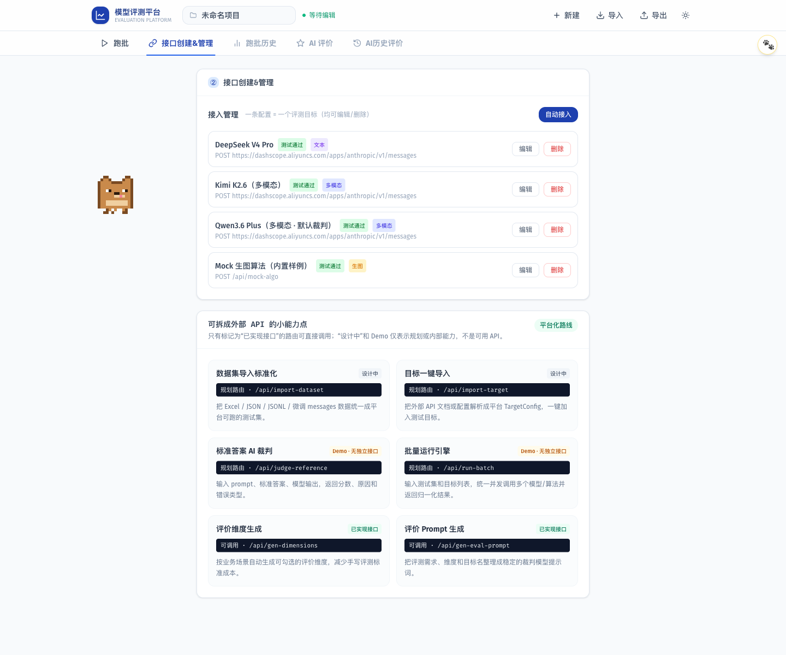

# PR 01 验收证据

## 验收范围

- 从远端重新克隆并迁移当前本地源码，原目录保持不变。
- 排除密钥、依赖、缓存、构建产物和本地 Agent 状态。
- 将四个不存在的 API 标记为“设计中”或“Demo”。
- 建立 75 项能力矩阵和六态定义。

## 自动检查

| 检查 | 结果 | 说明 |
| --- | --- | --- |
| 敏感信息扫描 | 通过 | 未发现真实环境文件、私钥文件或常见 Token 前缀 |
| `npm run lint` | 通过 | 9 条既有非阻塞警告，登记到 PR 02 |
| `npx tsc --noEmit` | 通过 | 无类型错误 |
| `npm run build` | 通过 | Next.js 生产构建成功，生成 19 个页面/路由 |
| 遗留任务池冒烟测试 | 通过但不计有效覆盖 | 4 项通过；测试复制实现逻辑，PR 02 改造 |
| Playwright 用户路径 | 通过 | 首页到“接口创建&管理”，控制台 0 错误 |

## 页面证据

截图中 `/api/import-dataset`、`/api/import-target` 为“设计中”，`/api/judge-reference`、`/api/run-batch` 为“Demo · 无独立接口”；只有两个真实路由标记为“已实现接口”。

## 回滚

PR 01 只操作新克隆目录和新分支。回滚时关闭 PR 或删除 `codex/chore-baseline-sync` 分支即可，远端 `main` 与原开发目录不受影响。
