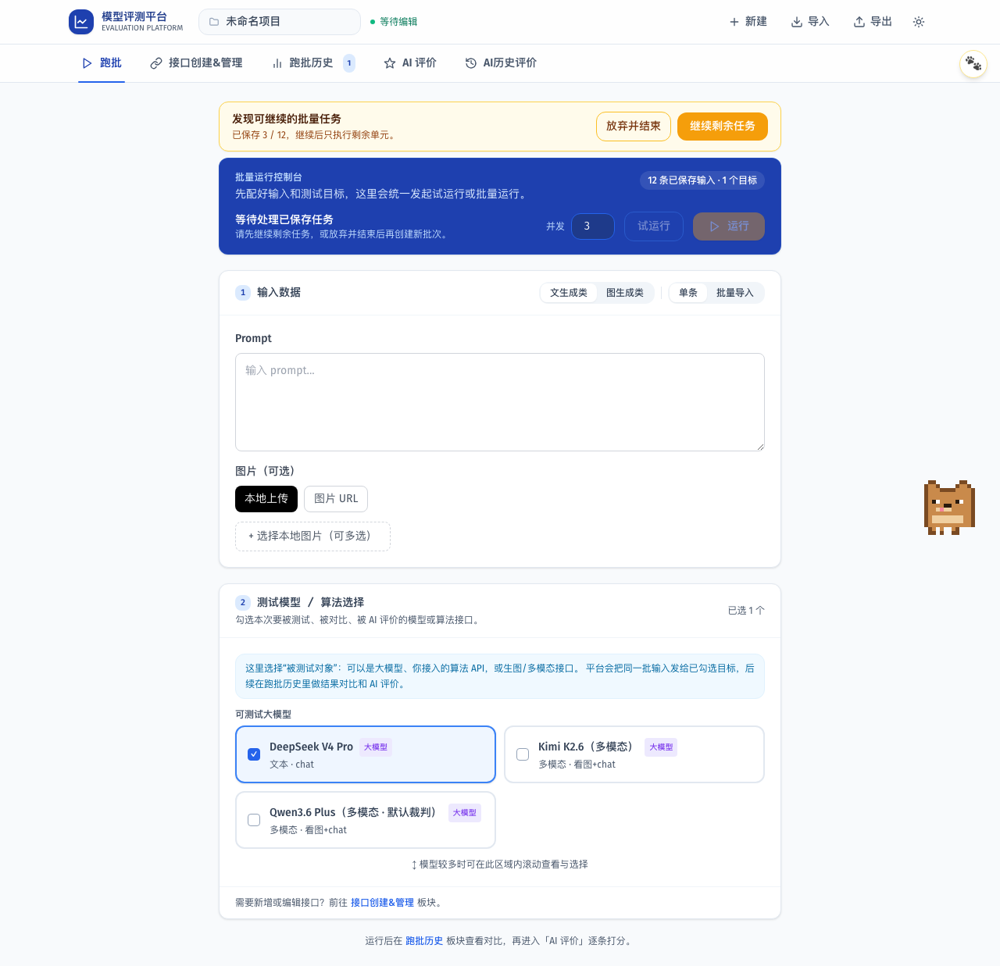

# PR 03A 验收证据

## 验收范围

- TASK-003：批量运行增量更新同一 Task，并按一致检查点写入 IndexedDB。
- TASK-004：页面刷新或意外中断后，从最近检查点继续未完成调用。
- TASK-008：暂停、继续、人工终止和放弃已保存任务具有独立语义。
- 不包含 QPS、失败项定向重跑、服务端任务队列、跨设备恢复或付费模型调用。

## 行为约束

- 批量任务在开始、每 10 个完成项、暂停和最终结束时立即保存。
- `success` 与 `error` 视为终态，自动恢复不会重复调用；`pending`、`running` 与 `interrupted` 恢复为待执行。
- 暂停保留原 Task ID 和进度；继续只运行剩余单元；终止或放弃写入 `cancelled`，不再出现恢复入口。
- 存在待续任务时禁止启动新批次，避免产生多个无法从首页准确定位的活动任务。
- 运行中或暂停中的批次不能进入 AI 评价，不会自动产生 Judge 模型费用。

## 自动化证据

| 门禁 | 本地结果 | 关键覆盖 |
|---|---|---|
| `npm run lint` | 通过 | 零警告、零错误 |
| `npm run typecheck` | 通过 | 新 Task、checkpoint 和页面回调类型一致 |
| `npm run test:unit` | 通过 | 6 个文件、21 项；稳定矩阵、进度、终态跳过和恢复请求 |
| `npm run test:e2e` | 通过 | 8 项；含暂停 3/12、自动保存、刷新续跑、无重复调用和人工终止 |
| `npm run build` | 通过 | 19 个路由生产构建成功 |

Playwright 的 `/api/run-custom` 响应全部为本地 Mock。测试不读取真实 Key、不调用模型、不自动启动 AI 评价。

## 视觉证据

截图显示同一 Task 已保存 `3 / 12`，用户可以继续剩余任务或放弃并结束；控制台同步显示 12 条已保存输入，并阻止误开新批次。

## 一致性与限制

当前采用客户端“最近一致检查点”语义，不承诺 exactly-once。突然关闭页面时，最近一次检查点之后尚未写入的最多 9 个完成调用可能重放；已落库终态不会重复。服务端持久队列、跨浏览器恢复与幂等请求键留给后续任务引擎 PR。

## 回滚

`Task.checkpoint` 为可选字段，不需要数据库迁移。回滚本 PR 后旧 Task 仍可读取，只会失去增量保存和恢复入口；不涉及 Key、服务端数据或远端任务清理。
