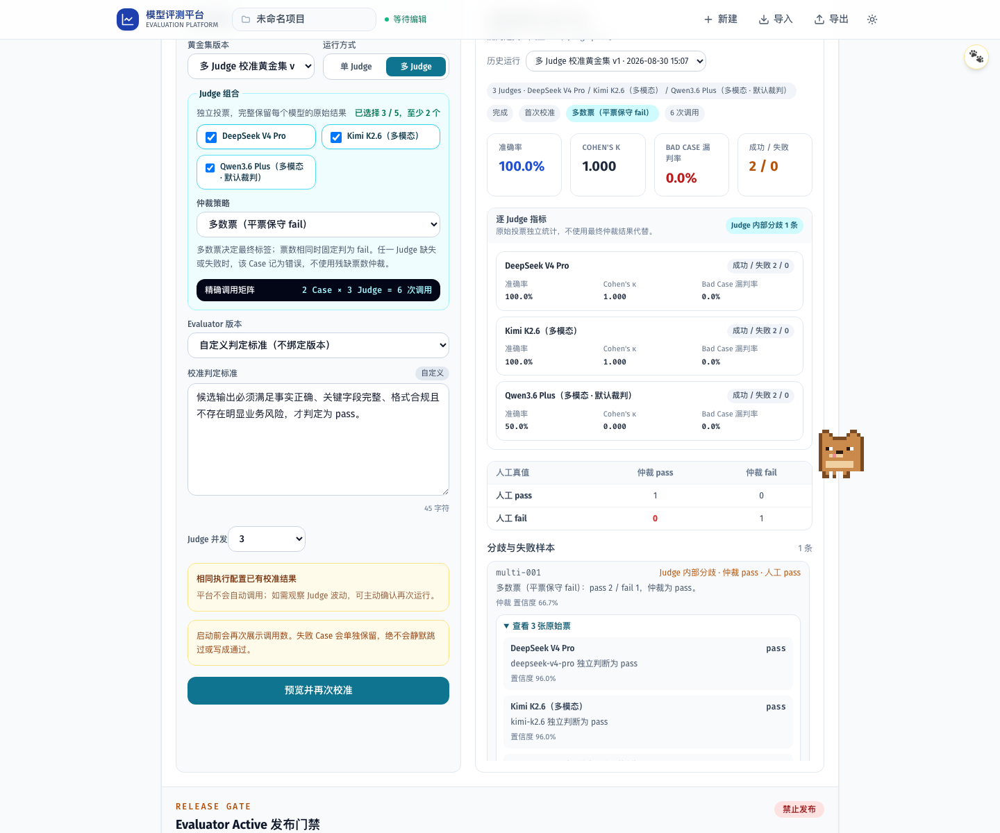

# PR 06H 验收证据

- 多 Judge 页面要求用户显式切换模式并选择 `2-5` 个 Judge；选择不足时运行按钮禁用，不会自动调用。
- 页面同时展示 `Case 数 × Judge 数 = Judge 调用数`，确认弹窗再次列出 Judge 集合、仲裁策略、精确调用公式和 `0` 次被测模型调用。
- 运行历史展示最终仲裁指标、逐 Judge 独立指标、Judge 内部分歧数，并允许按 Case 展开全部原始票、理由、置信度或错误。
- Mock Playwright 使用 `2 Case × 3 Judge = 6` 验证取消前零请求、确认后精确六请求、人工标签与复核说明隔离、结果持久化和刷新零新增请求。
- WCAG 自动检查覆盖费用确认弹窗和多 Judge 结果区；首轮发现宽表横向滚动缺少键盘入口，最终改为无需横向滚动的紧凑指标卡并通过复验，未关闭 Axe 规则。
- 本地 quality 通过 300 文件 Secret Scan、零警告 lint、typecheck、146 项真实源码单测、2 项压力测试和 20 路由生产构建；全量 28 项 Playwright 全部通过。
- 视觉截图 `multi-judge-calibration.png` 已人工检查，配置、精确调用公式、仲裁结果、逐 Judge 指标和原始票在双栏内可直接阅读。
- 功能快照 `3247632` 已在独立 detached 工作树全新安装 434 个包，并再次通过完整 quality 与 28 项 Playwright；测试后 HEAD 未漂移且 Git 零改动。
- 分支已推送并自主创建 [PR #33](https://github.com/boyuling-123/AI-API-workspace/pull/33)；首轮 workflow run `33298736070` 的核心质量与 Playwright/WCAG 两个 Job 全部通过。
- 最终文档提交对应 workflow run `33298865195` 两道 CI 通过；远端无漂移、无 Review 或未解决线程，以普通 fast-forward 合并 PR #33，合并 SHA 为 `ff14ab5`。
- 所有测试使用 Mock，未读取真实密钥，未调用真实或付费模型，未自动启动 AI 评价。

## 视觉证据

