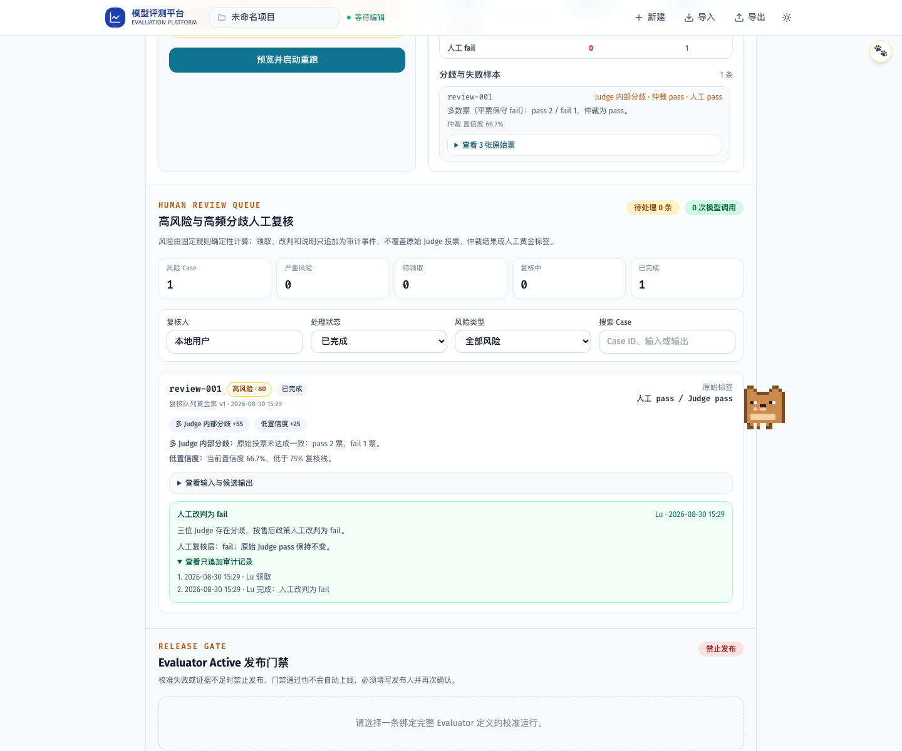

# PR 07A 验收证据

- 风险队列使用固定规则识别 Judge 错误、Bad Case 漏判、人工/Judge 分歧、多 Judge 内部分歧、低于 `75%` 的置信度和跨运行重复风险；每条规则展示名称、具体依据与分数。
- 同一黄金集家族的 Case 按历史风险运行次数聚合，并按严重度、分数、频次、运行时间确定性排序；整个过程不调用模型。
- 领取和完成是项目级只追加事件，保存原始人工/Judge 标签、风险快照、操作者、时间、结论、说明、领取引用和完整性指纹；人工改判不覆盖原始校准结果。
- 页面支持待处理、待领取、复核中、已完成，以及高风险、分歧、失败、低置信度和关键词筛选；损坏事件告警并从状态计算排除。
- Mock Playwright 使用 `2 Case × 3 Judge = 6` 验证风险解释、领取、改判、审计展开、刷新持久化和复核前后零新增 API 请求。
- WCAG 检查覆盖完整复核队列。首轮全量回归发现领取按钮对白对比度为 `3.18:1`，提高背景色后相关 4 项与全量 29 项 Playwright 通过，未禁用 Axe 规则。
- 6 项真实源码单测覆盖风险分类、重复频次、只追加状态、脱敏、跨人/重复/空说明异常和篡改事件排除。
- 初始基线本地 quality 通过 305 文件 Secret Scan、零警告 lint、typecheck、152 项真实源码单测、2 项压力测试和 20 路由生产构建；全量 29 项 Playwright 全部通过。
- 发现远端平台总览工作前进后，功能安全重放到最新 `main@9798b53`，快照 `4c03e5e` 在独立 detached 工作树全新安装 434 个包；309 文件 Secret Scan、152 单测、2 压测、20 路由构建和 `CI=1` 全量 31 项 Playwright 再次通过，结束时 HEAD 未漂移且 Git 零改动。
- 视觉截图 `calibration-review-queue.png` 已人工检查，风险依据、原始标签、人工覆盖层和领取/完成审计在同一屏可读。
- 所有自动化使用 Mock；未读取真实密钥，未调用真实或付费模型，未自动启动 AI 评价。

## 视觉证据

