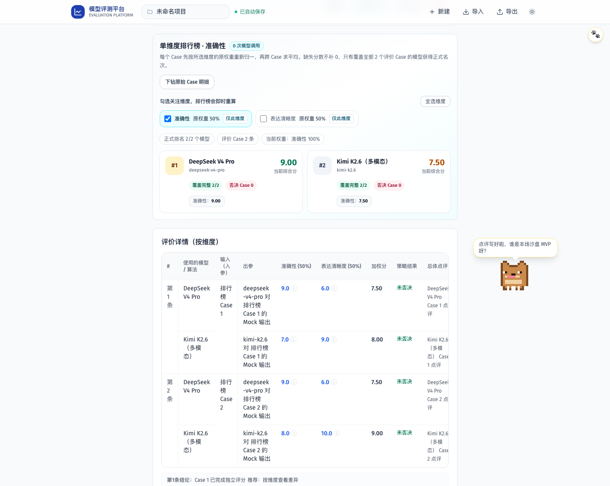

# PR 07B 验收证据

- 排行榜只读取历史 `EvaluationRecord` 的原始维度分数，不调用 Judge 或被测模型，也不写回评价记录。
- 综合榜按所选维度原权重重新归一后逐 Case 计算，再跨 Case 求平均；选择单个维度时自动成为单维度榜。
- 缺失、非有限或越界分数不补零；覆盖不足模型继续展示已有分数、覆盖率和否决次数，但不获得正式名次。
- 同分使用竞赛排名，稳定目标 ID 负责确定展示顺序；高精度边界归整消除 JavaScript 浮点尾差。
- 页面支持任意维度勾选、仅看单维度、恢复全选，并提供原始 Case 明细锚点；旧无维度历史显示明确降级说明。
- 5 项真实源码单测覆盖权重归一、单维度反转、原记录不变、缺失值、并列名次和旧记录等权兼容。
- Mock Playwright 使用 `2 Case × 2 模型` 验证综合榜、单维度名次反转、零新增 API 调用、原始理由下钻、刷新持久化、390px 无横向溢出和 WCAG。
- 首轮 Axe 检查发现“原权重”辅助文本对比度约为 `2.5:1`；加深同类弱文本后通过，未禁用 WCAG 规则。
- 本地 quality 通过 315 文件 Secret Scan、零警告 lint、typecheck、157 项真实源码单测、2 项压力测试和 20 路由生产构建；全量 32 项 Playwright 全部通过。
- 功能快照 `95335f4` 在独立 detached 工作树全新安装 434 个依赖，并再次通过完整 quality 与 `CI=1` 全量 32 项 Playwright；结束时 HEAD 保持不变且 Git 零改动。
- 锁文件仍报告既有 6 个 high 级依赖审计项；未执行可能引入破坏性升级的 `npm audit fix --force`，继续留给依赖治理专题。
- 分支已自主创建 [PR #37](https://github.com/boyuling-123/AI-API-workspace/pull/37)；首轮 head `49be063` 对应 workflow run `33300809061`，核心质量与 Playwright/WCAG 两个 Job 全部成功。
- 视觉截图 `evaluation-leaderboard.png` 已人工检查，单维度选择、当前权重、名次、分数、覆盖率、否决次数和原始 Case 明细在同一屏可读。
- 所有自动化使用 Mock；未读取真实密钥，未调用真实或付费模型，未自动启动 AI 评价。

## 视觉证据

