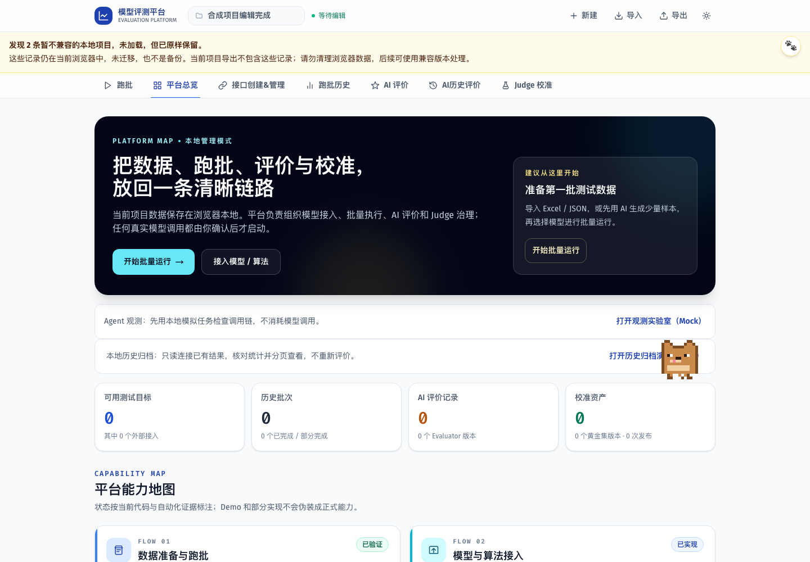

# F-STORE-001 验收证据

当前：本地完整门禁通过；[PR #47](https://github.com/boyuling-123/AI-API-workspace/pull/47) 已合并。功能提交 `037c527` 的 [首轮 CI 34053067332](https://github.com/boyuling-123/AI-API-workspace/actions/runs/34053067332) 与最终 head `89d21c998795673eeb92b7b4f8e0559e68f81f5f` 的 [最终 CI 34053385100](https://github.com/boyuling-123/AI-API-workspace/actions/runs/34053385100) 均两道 Job success。03:04 复核 head/base 无漂移、无阻塞 Review、GitHub Ready to merge 后正常合并，SHA `328191879d0bc4117a608f386041c796c37f6a1a`。

范围：兼容性读取不删除、同 ID 不兼容记录写保护、中文保留提示及安全错误。所有验收数据为合成数据；不读取用户浏览器项目、真实密钥或模型，不调用评价接口。

## 本地结果（2026-09-07）

| 门禁 | 结果 |
| --- | --- |
| lint / typecheck / build | 零 lint 警告，类型检查通过，22 路由生产构建成功 |
| 真实源文件单测 | 229 / 229；新增 projectStorage 9 项直接运行 db.ts 和 Dexie，不复制实现 |
| 压力回归 | 2 / 2；仅原任务池范围，不代表大数据存储压测 |
| Playwright 全量 | 47 / 47，通过隔离 Chromium 的真实用户路径 |
| 新增存储浏览器路径 | 4 / 4：混合旧项目、全部旧项目、quota 写失败、getAll 读失败；未发起 API 调用、无控制台错误 |
| 读写不变性 | 无索引/未知版本逐字段相等；刷新不增加额外项目；事务阻止同 ID 覆盖；保存失败仍保留原记录 |
| 可访问性与视觉 | 新提示 WCAG 扫描零违规；390px 无横向溢出；合成截图逐项目视复核，提示可读且不遮挡编辑区 |
| Diff 与密钥 | git diff --check 通过；提交前 Secret Scan 覆盖 382 个仓库文件，无真实密钥或私有数据 |

`npm audit` 仍为既有 7 项（6 high、1 low），不含 fake-indexeddb；本 PR 不宣称依赖安全债务清零，不做强制大版本升级。浏览器的普通 NO_COLOR/FORCE_COLOR 启动警告不属于页面控制台错误。

## 审查与回滚

本次角色自检发现并同时修复三处边界：目录读取会 bulkDelete；updateTime 索引会漏掉缺字段记录；put 可覆盖同 ID 的未知项目。检查覆盖排序、原值不变、写保护事务、错误隐私与新项目编辑。没有独立第三方批准，远端最终 CI 成功后按已授权流程合并。

不改 IndexedDB 的数据库名、表、Schema 或原存储记录。正常 revert 可撤回代码，但旧实现会重新引入隐式删除风险，应优先向前修复；没有数据库回滚操作。原工作树四项草稿未改。

不能证明：历史数据迁移、恢复此前已删除记录、完整嵌套结构验证、备份、大数据持久化或未来后端接口。
