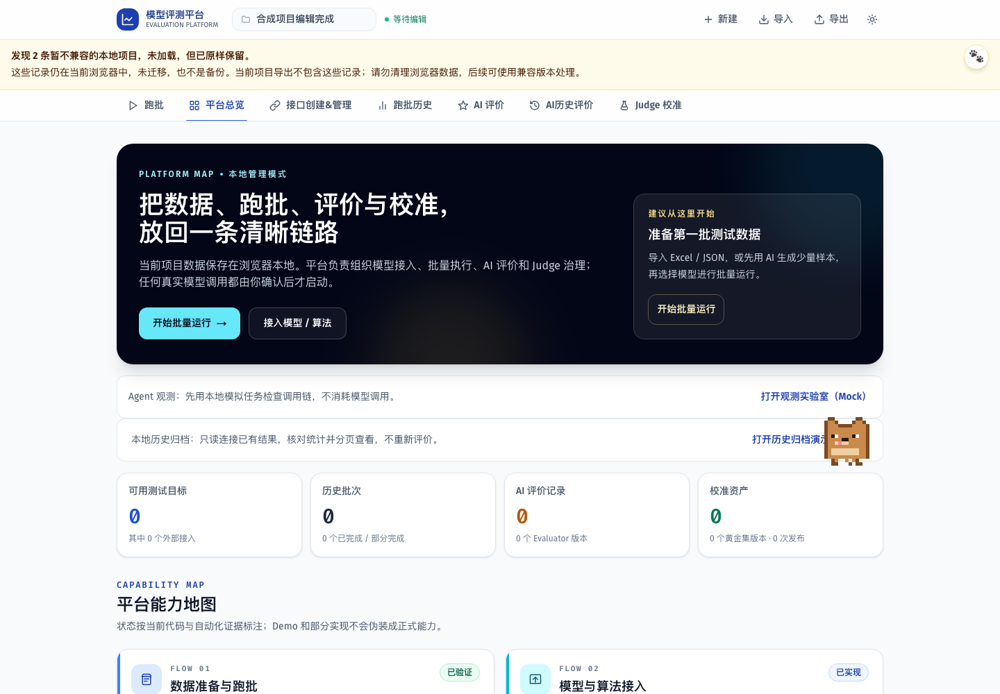

# F-STORE-002 验收证据

当前：本地完整门禁通过，[PR #48](https://github.com/boyuling-123/AI-API-workspace/pull/48) 已合并。功能提交 `1025f8e` 的 [首轮 CI 34054586655](https://github.com/boyuling-123/AI-API-workspace/actions/runs/34054586655) 及最终 head `cc340abd82e130e22cca66fb77b98b1e5b4e6329` 的 [最终 CI 34054851224](https://github.com/boyuling-123/AI-API-workspace/actions/runs/34054851224) 均两道 Job success。03:30 核对 head/base 无漂移、无阻塞 Review、GitHub Ready to merge 后正常合并，SHA `0a26dbfbed36378e9b8c93ce5972d9fe67e41dfd`。

范围：ProjectRepository 契约、真实 IndexedDB 默认适配器、组合入口与 Hook 接入；没有新后端或运行时切换，没有新的业务 UI。既有旧项目保留页面必须在本轮源代码上重新跑浏览器测试。

## 本轮本地门禁

| 门禁 | 结果 |
| --- | --- |
| lint / typecheck / build | lint 零警告、类型检查与 22 路由生产构建通过 |
| 真实源码单测 | 237 / 237；新增 8 项，其中 6 项对真实默认 Dexie 适配器验契约，2 项用真实源码 AST 验依赖边界 |
| 压力回归 | 2 / 2，仅既有任务池范围，不代表 20GB 存储压测 |
| 全量 Playwright | 47 / 47，验证现有跑批、评价、归档、保存和异常路径 |
| 独立证据复跑 | 4 / 4 旧项目保留路径再次运行，成功 Trace 全部生成，新截图实际采集并目视复核 |
| 可访问性 | 新提示区域 WCAG 零违规、390px 无溢出；现有主路径 serious/critical 门禁通过 |
| 数据与网络边界 | 全部合成数据、原用户数据库未读取；存储测试所有 API 调用数为零，页面控制台错误为零 |
| Diff / Secret Scan | 检查通过，提交前对最终 392 个仓库文件复扫；无新增生产依赖或真实配置 |

首次故障测试曾错误要求异常对象引用相等；真实 Dexie 会包装底层异常。调整为验证确实拒绝、QuotaExceededError 类型、原记录不变及固定安全文案后通过，没有改生产逻辑来迎合测试。

截图与 PR #47 相同用户路径，但来自本轮组合入口/适配器代码，不复用旧截图。原有宠物装饰仍可能视觉覆盖归档链接，已登记后续轻量 UI 节点；本存储 PR 不夹带界面改造。

## 成功 Trace

四条 Trace 保存在 Git 忽略的 `local-data/repository-e2e/`，不上传完整运行轨迹；以下 SHA-256 用于本机核验。公开截图仅含合成数据。

| 路径 | Trace SHA-256 |
| --- | --- |
| 读失败不清理 | `f6717693e1ea20a4ebf3d7de422a48e4c3d5383174bfb4d9859dd55f5ecb9bdb` |
| 全旧项目保留 | `2ad227d140f6402f790e4b51bfa097853a806f8d88735d2371568cf6b3f3432b` |
| 配额异常不泄露 | `f7565ed645240ab3ffb9107b1fc57bbf2acbf3b5678db8a94523e6c48842f216` |
| 编辑刷新与提示 | `e3d8489003d8984da367ca01ace028492182654bfaa2c9d3221d8af8abb1100d` |

采集命令：`CAPTURE_EVIDENCE=1 STORAGE_EVIDENCE_PATH=docs/evidence/pr-project-repository/repository-preservation.png npm run test:e2e -- tests/e2e/legacy-project-preservation.spec.ts --trace on --output local-data/repository-e2e`。复验会覆盖这一合成证据目录，不涉及用户归档。

## 审查与限制

自检核对依赖方向、默认实现、数据库身份、兼容读取与写保护、错误传递、快照隔离和显式删除。没有独立评审者批准；最终 head CI 成功后再正常合并，不绕过分支保护。

回滚仅 revert 本 PR，回到 PR #47 的直接 db 调用；保留 PR #47 的数据保护，不迁移或删除数据库。draftDb、归档、MCP 桥接和 20GB 级存储均不在本次已验证范围。
